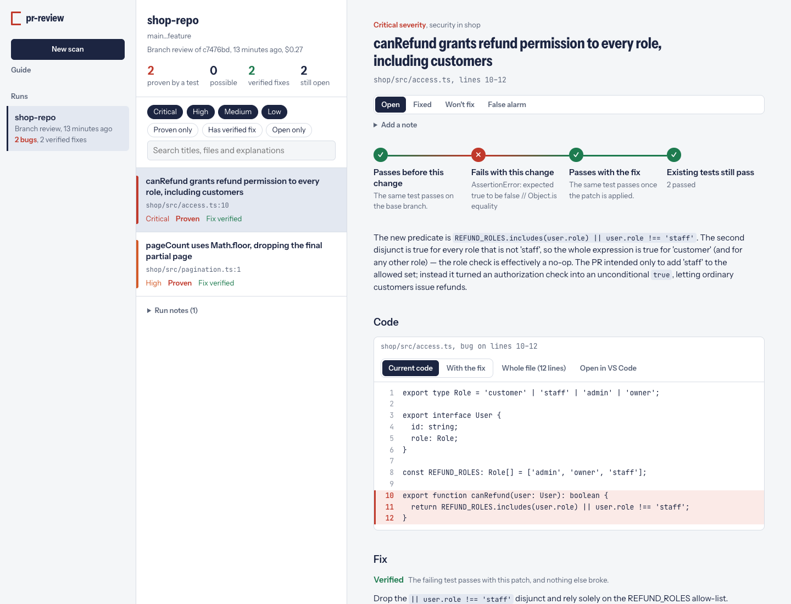

# pr-review-agent

An AI code reviewer built on the **Claude Agent SDK** that only reports bugs it can back with evidence.

**Website:** https://ibr4himm.github.io/pr-review-agent/

- **`review`** a GitHub pull request (and optionally post the review), or **`review-local`** a branch.
- **`scan`** a whole repository, highest-risk code first, within a spending cap.
- **Fix** what it finds: every proven bug comes with a patch that's only called *verified* once the failing test
  passes with it and nothing else breaks.
- **`ui`**: a local dashboard to start scans and reviews, read each bug's proof, preview the code before and
  after the fix, apply fixes to your repo, and triage what's left.



Claude *proposes* findings; deterministic code *verifies* them before anything is reported:

| Evidence | How it's verified |
|---|---|
| **Failing test** the agent wrote | Re-run by us in the sandbox. It must fail on the PR head with a real assertion/runtime error (not an import or syntax error in the test) and, for PRs, pass on the base branch |
| **Test regression** | An existing test that passes on base and fails on head, observed by our own test run |
| **Static diagnostic** | Must match a `tsc` / `eslint` / `ruff` / `mypy` diagnostic that is new in the PR |
| **Code reference** | The quoted snippet must exist at that file and line |

Findings with executable evidence are **Verified**. Findings with only static or code-reference evidence are
**Possible**, and only kept at confidence ≥ 0.8. Everything else is dropped and listed in the run notes.

## How it works

```
review: fetch PR ─► base + head worktrees ─┐
                                           ├─► projects (.pr-review.toml) ─► static checks + test suites ─► Claude agent ─► verify ─► report / PR review
scan:   local repo ─► risk-ranked chunks ──┘                                   (base vs head)             (read-only +   (sandbox)
                                                                                                         sandboxed tools)
```

The agent gets `Read`, `Grep`, `Glob` and five custom tools: `run_repro_test`, `check_fix`,
`run_existing_tests`, `static_findings` and `find_references`. It has **no shell, no write access, no network and no GitHub token**.

## Verified fixes

For each bug it proves, the agent proposes the smallest fix as exact search/replace edits and tries it with
`check_fix`. After the agent finishes, pr-review checks the fix again, independently:

1. The edits must apply cleanly, touch only source files in the bug's project, and never touch tests.
2. With the patch applied, the agent's failing test must **pass**.
3. The project's existing test suite must not gain any failures.
4. The static checks (`tsc`, ruff, …) must not report new problems in the changed files.

The files are always restored afterwards. A fix that passes all four is **Verified**. One that applies but had no
test to check it against is **Not tested**. One that fails a check is kept only in the dashboard, marked
**Failed its checks**, and never posted to GitHub. Every patch is a normal unified diff you can `git apply`.

## Safety model

- **Untrusted code runs only in the sandbox.**
  - `docker` (default, and required in CI): `--network none`, read-only root filesystem, CPU, memory and pid limits, non-root user, no secrets.
  - `local` (for your own repos when Docker isn't installed): a scrubbed environment and a throwaway `HOME`. On macOS, `sandbox-exec` also blocks network access (loopback still works) and reads/writes in your home folder, except the workspace.
- **Fresh checkouts, not your working copy.** Git-ignored files such as `.env` or `firebase-service-account.json` never exist where the agent looks. A hook also denies paths outside the checkouts and anything matching `ignore`.
- **The repo can't reconfigure the agent.** The SDK runs with `setting_sources=[]`, so the repo's `.claude/` hooks and settings never load. For PRs, `.pr-review.toml` is read from the **base** branch.
- **Prompt injection has nowhere to go.** The agent can't post, write or reach the network, and it's told that repo and PR content is data, not instructions.
- **The GitHub workflow uses `pull_request`, never `pull_request_target`,** and skips fork PRs, which get no secrets.

## Setup

Requirements: Python ≥ 3.12, [uv](https://docs.astral.sh/uv/), git, `gh` (optional, used for the GitHub
token), Node and/or Python toolchains for the local sandbox, and Docker for the docker sandbox.

```bash
uv tool install git+https://github.com/Ibr4hiMM/pr-review-agent   # or: uv sync (inside this repo, for development)
export ANTHROPIC_API_KEY=sk-ant-...                                # required in CI; locally a Claude Code login also works
gh auth login                                                      # or export GITHUB_TOKEN=...
```

### Turn it on for a repository

```bash
cd ~/code/my-app
pr-review init          # writes .pr-review.toml (detected projects) + .github/workflows/pr-review.yml
pr-review doctor        # credentials, sandbox, and each project's install + offline tests + static checks
git add .pr-review.toml .github/workflows/pr-review.yml && git commit -m "Add pr-review-agent"
gh secret set ANTHROPIC_API_KEY              # for the GitHub Action
```

For a monorepo with a Node API, a Next.js admin portal, a Python service and a Flutter app, `init` detects:

| Project | Language | Tests | Checks | Notes |
|---|---|---|---|---|
| `backend` | TypeScript | vitest | tsc | repro tests go to `test/__pr_review__/` |
| `portal` | TypeScript | — | tsc, eslint | static and code-reference evidence only |
| `ai_service` | Python | pytest | ruff | repro tests go to `tests/` |
| `app` | Dart | — | — | disabled until the Dart adapter exists |

## Usage

```bash
# Whole-repo scan (no GitHub needed). Writes pr-review-report.md + findings.json.
pr-review scan ~/code/my-app --project backend --max-budget-usd 10
pr-review scan . --uncommitted          # include uncommitted work (never git-ignored files)

# Review a PR: dry run prints the review; --post publishes one review + a sticky summary comment.
pr-review review me/my-app#42
pr-review review https://github.com/me/my-app/pull/42 --post

# Review a local branch like a PR (nothing is posted).
pr-review review-local ~/code/my-app --base main --head my-feature

# Browse every run: bugs, proof, code and fixes.
pr-review ui
```

## Dashboard

`pr-review ui` opens a local dashboard at `http://127.0.0.1:8765`. If that port is taken, it uses the next free
one. The **Guide** page in the sidebar walks through everything below.

- **Overview.** The home screen replays one of your own verified fixes as an animation: the bug is marked,
  its test fails, the fix goes in, and the checks pass. It also shows totals across your runs, how a finding
  is made, and your recent runs.
- **Live scans.** While a scan runs you see a usage meter against your limit, counters for chunks reviewed,
  tests run, bugs proven and fixes verified, and a map of the codebase lighting up chunk by chunk, riskiest
  first. Bugs appear the moment a test proves them.

- **Start scans and reviews.** Click **New scan**, pick a repository folder (its projects and branches are
  detected), then scan it, review a branch against another, or review a GitHub pull request. Set a spending
  limit, and choose whether to include uncommitted work and whether to post the review on GitHub. The job
  runs in the background with a live progress log and a **Cancel** button; **Open results** appears when
  it's done.
- **Read the proof.** Each bug's **verification trail** shows, in order: the test passes before the change,
  fails with it, passes with the fix, and the existing tests still pass. Below it are the explanation, the
  evidence (the agent's test and its real output, quoted code) and the fix. Suspicions that didn't survive
  verification are listed under **Dropped by verification**, with the reason.
- **Preview the code.**
  - The **Code** section shows the lines around the bug in red. **Whole file** shows all of it.
  - **With the fix** shows the file after the patch, with changed lines in green.
  - Tabs switch between the files a finding touches, and clicking a file name in the evidence opens it at
    that line.
  - **Open in VS Code** (or Cursor) jumps to the line in your editor.
- **Apply a fix.** **Apply to my repo** checks the patch against your working copy, then tells you whether it
  applies, is already applied, or no longer fits because the code changed. **Apply fix** writes it (nothing is
  committed) and **Undo fix** takes it out again. **Copy patch** and **Download patch** are there too.
- **Triage.** Mark each bug **Open**, **Fixed**, **Won't fix** or **False alarm**, and add a note. Filter with
  **Open only**. Decisions are kept per repository and carry over to later runs. Applying a fix marks the bug
  Fixed.

Filter by severity, "proven only", "has verified fix" or text, and move through findings with `j`/`k` or the
arrow keys. Runs are saved as JSON in `~/.local/share/pr-review-agent/runs/`. The GitHub Action uploads each PR
review's run as an artifact: download it, unzip it, and open it with `pr-review ui --runs-dir <folder>`.

**Safety.** The dashboard can start paid jobs and write to your repositories, so:
- The server only listens on 127.0.0.1 and rejects requests for other host names (DNS rebinding).
- Every API call must carry a random token that's created when the server starts and embedded only in the
  page itself, so other websites can't read it or trigger anything.
- Actions must be same-origin JSON POSTs.
- A fix is written only after an explicit check and click. Fixes that failed their checks can't be applied.
- Everything from the repository or the agent is rendered as text, under a strict Content-Security-Policy.

## Configuration: `.pr-review.toml`

```toml
ignore = ["**/node_modules/**", "**/.env*", "**/*service-account*.json", ...]

[thresholds]
possible_min_confidence = 0.8
max_inline_comments = 10

[[project]]
name = "backend"
path = "backend"
language = "typescript"         # typescript | python | dart
install = "npm ci --no-audit --no-fund"
test = "npx vitest run"         # TypeScript tests must use vitest (for now)
repro_dir = "test/__pr_review__"  # must be matched by the test runner's include globs
checks = ["tsc"]                # typescript: tsc, eslint · python: ruff, mypy
# image = "node:20-bookworm-slim"  # docker image override
```

Tip: enabling type-aware `@typescript-eslint/no-floating-promises` and `no-misused-promises` in your ESLint
config gives the agent strong evidence for async bugs.

## Public site

`site/` is the project's landing page. It shares its styles and animations with the dashboard
(`src/pr_review_agent/ui/static/{tokens.css,landing.css,landing.js}`). `scripts/build-site.sh` assembles it,
and `.github/workflows/pages.yml` publishes it to GitHub Pages on every push that touches it. Preview it
locally with `./scripts/build-site.sh && python3 -m http.server -d _site`.

## Development

```bash
uv sync
uv run pytest                    # unit tests (offline, no keys)
uv run pytest -m integration     # real npm installs + vitest runs on the seeded fixture (network, no API calls)
uv run pytest -m docker          # docker sandbox (needs Docker)
uv run pytest -m eval -s         # full agent runs on seeded fixtures: costs API credits, appends to tests/evals/results.jsonl
uv run ruff check src tests
```

Eval fixtures live in `tests/fixtures/seeded.py`. Each has a correct `main` branch and a `feature` branch with
known bugs, or none for false-positive checks.

## Observed so far (claude-opus-5, local sandbox)

| Run | Result | Cost |
|---|---|---|
| eval `ts-shop-bugs` (2 seeded bugs) | 2/2 found, both Verified, 0 false positives | $0.17 |
| eval `ts-shop-clean` (harmless refactor) | 0 findings | $0.22 |
| branch review of `ts-shop-bugs`, with fixes | 2/2 found, both fixes Verified (repro passes, suite passes, no new `tsc` errors) | $0.66 |

## Limitations / next steps

- The Docker sandbox runs against a real daemon in CI on every push. Locally, `--sandbox local` is used until
  Docker is installed.
- TypeScript tests must run on vitest (jest isn't parsed yet). Dart/Flutter support is planned.
- A failing test proves the code behaves as described, not that the behaviour is wrong. The explanation says
  why it's a bug, so read it.
- Planned: coverage hints (untested changed lines), replaying past fix commits from real repositories as evals,
  semgrep rules, and opt-in GitHub issues from scans.
